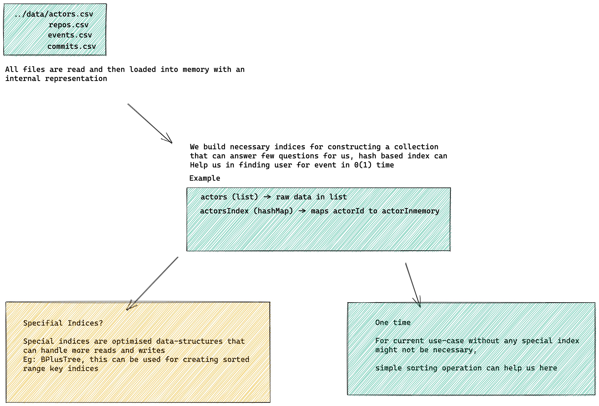
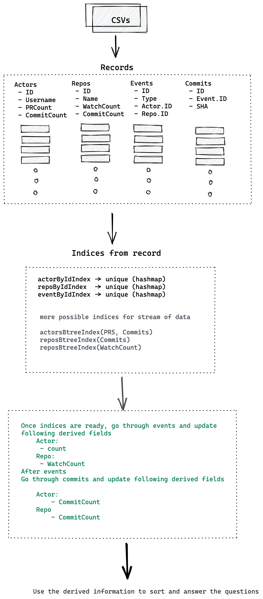

# Test assignment for Analytics Software Engineer position

### usage

```shell
    make clean build run

    or

    make clean build
    ./analytics-software-engineer-assignment ./assets/data
    # ^^ this should work, repo contains commit with
    # these extracted files
    ./analytics-software-engineer-assignment mydirwithfiles
```

#### Opinion

IMO analysis like this would require one to build a fully fledged database. This database would have custom indices (again data-structures) which are kind of optimized for kind of queries that we run.

#### Pipeline



#### Brief about the approach



## License

None, take it, it's for free
